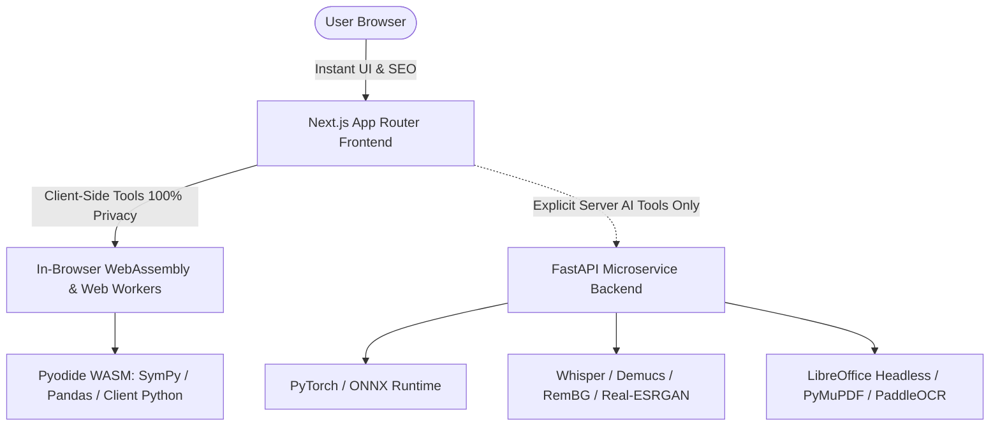

# Cleartrix: Project Command & Transition File

> **Product:** Cleartrix (umbrella brand, 175-tool privacy-first web platform)  
> **Flagship product:** Resume Builder (formerly "Cleartrix Resume Builder", repo `cleartrix`)  
> **Stack:** Next.js App Router, React, TypeScript, Tailwind, Zustand, Zod, Radix UI, Python (FastAPI + Pyodide for AI/media boost), Prisma/PostgreSQL (Phase 5 only)  
> **Owner decisions still open:** domain name, trademark check, final resume-product name (see section 12)  

**How to use this file**
- **Part A (sections 1-8)** is the standing project command. Keep it in the repo root (for example as `PROJECT.md`, or copy it into `CLAUDE.md` / your AI assistant's instructions file) so every coding session follows the same rules.
- **Part B (sections 9-13)** is the one-time transition from Cleartrix Resume Builder to Cleartrix: rename, data migration, redirects, and go-live checklist.
- For a comprehensive technical reference, resolved engineering gotchas, 46-tool catalog log, and step-by-step AI workflows, see [`PROJECT_BLUEPRINT.md`](./PROJECT_BLUEPRINT.md).

---

# PART A: PROJECT COMMAND

## 1. Mission and non-negotiable rules

Cleartrix is one fast, free website with every everyday file, text, media and calculator tool, each on its own SEO page. The differentiator is **privacy: files are processed in the browser and never uploaded.**

**Invariants (never break these):**
1. **No upload for client-side tools.** No `fetch`, `XMLHttpRequest`, `sendBeacon` or form POST may carry user file content or text. Only tools marked `runtime: 'server'` (Phases 4-5) may send data, and they must say so on the page.
2. **No mandatory registration** for any Phase 1-3 tool. Accounts are optional and only for Phase 5 features.
3. **Free means free:** no watermarks, no paywalled downloads on Phase 1-3 tools. Pro sells volume (bigger files, batch, AI credits), not basic output.
4. **Lazy-load heavy libraries.** `@react-pdf/renderer`, `docx`, `pdfjs-dist`, `ffmpeg.wasm`, `tesseract.js` must never load on pages that do not use them.
5. **Every tool has its own SEO page** generated from the registry.
6. **Existing resume builder keeps working** at every step of the merge (`npm run check` must stay green).

## 2. Product structure

| Area | Route | Notes |
| :--- | :--- | :--- |
| Landing (Cleartrix) | `/` | Brand hero, featured tools, privacy promise, resume builder highlight |
| Tools hub | `/tools` | Search, categories, popular tools |
| Category page | `/tools/[category]` | Lists tools of one category (SEO hub) |
| Tool page | `/tools/[category]/[slug]` | One tool, generated from registry |
| Resume Builder | `/editor`, `/dashboard` (keep as-is at first) | Optional later move to `/resume-builder/*` with 301 redirects |
| Static pages | `/privacy`, `/terms`, `/brand` | Update text for Cleartrix |

**Category slugs:** `documents-pdf`, `images`, `security-privacy`, `sharing`, `codes`, `video`, `audio`, `builders`, `developer`, `utilities`, `calculators`.

## 3. Target architecture

Keep the single Next.js app now. Do not split into a monorepo until the team grows. Add these next to existing folders:

```
app/
  tools/
    page.tsx                        # hub
    [category]/page.tsx             # category hub
    [category]/[slug]/page.tsx      # tool page (reads registry)
components/
  tool-shell/                       # ToolLayout, UploadBox, ProgressBar, ResultPanel, ErrorState, RelatedTools
lib/
  brand.ts                          # single source for name, tagline, domain, colors
  registry/
    types.ts                        # ToolDefinition, CategoryId
    categories.ts                   # 11 categories
    tools.ts                        # all 175 tools (one entry each)
  workers/                          # worker runner (cancel, progress, memory guard)
  storage/                          # prefixed localStorage + IndexedDB helpers
tools/
  <category>/<slug>/
    index.tsx                       # UI (uses ToolLayout)
    logic.ts                        # pure functions, unit-tested
    logic.test.ts
```

**Registry entry (one per tool):**

```ts
export type Runtime = 'client' | 'client-worker' | 'server';
export type HeavyDep = 'react-pdf' | 'docx' | 'pdfjs' | 'pdf-lib' | 'ffmpeg' | 'tesseract' | 'konva';

export interface ToolDefinition {
  slug: string;                       // kebab-case, unique, never changes after launch
  name: string;
  category: CategoryId;
  phase: 1 | 2 | 3 | 4 | 5;
  status: 'planned' | 'in-progress' | 'live';
  runtime: Runtime;
  heavyDeps?: HeavyDep[];
  seo: { title: string; description: string; h1: string; intro: string; faq: { q: string; a: string }[] };
  related: string[];                  // slugs
  load: () => Promise<{ default: React.ComponentType }>;   // dynamic import
}
```

The tool page, category page, hub search, navigation and `sitemap.ts` are all generated from this registry. Never hand-write a tool route.

## 4. Reuse map (do not rebuild what exists)

| Existing asset | Reuse for |
| :--- | :--- |
| `lib/pdf` (react-pdf) | Invoice, quote, certificate, letterhead, proposal, business card, Markdown to PDF |
| `lib/docx` | DOCX creator/editor, cover letter, PDF to Word (basic) |
| `lib/import` (pdfjs + mammoth) | PDF text extraction, form field extractor, public **ATS Resume Checker** |
| ATS audit engine | Free public ATS checker page (strong SEO) |
| Zustand + Zod patterns | Tool state, options validation |
| Radix UI + Tailwind tokens | Tool shell UI |
| `scripts/` test runners | Extend with `test:registry` and `test:tools` |
| Prisma + PostgreSQL | Phase 5 accounts, billing, sharing |

**Rule for builders (resume, invoice, certificate, poster...):** one source template rendered to DOM and PDF only. Add DOCX only where users clearly need it. Do not repeat the 3-renderer pattern for every template.

## 4B. Python Hybrid Architecture & AI Boost (FastAPI + Pyodide)

Next.js (TypeScript) and Python form a high-performance **hybrid architecture** that balances privacy, UI speed, and deep computational/AI power:



### 1. Why Python + Next.js is an Exceptional Strategy for Cleartrix
- **Next.js Strengths:** Lightning-fast static prerendering (SSG), best-in-class SEO for 175 landing pages, responsive mobile UI, client-side state (Zustand), zero server cost for standard tools.
- **Python Strengths:** Undisputed global standard for Artificial Intelligence, machine learning models, audio stem processing, computer vision, scientific math, and high-fidelity document conversion.
- **Combined Advantage:** Keep 80%+ of everyday tools running client-side in Next.js/TypeScript with zero server costs, while unlocking heavyweight Phase 4 AI capabilities and high-fidelity conversions via a specialized Python engine.

### 2. Layer A: Client-Side Python via WebAssembly (`Pyodide`)
- **How it works:** Runs standard Python and scientific wheels (NumPy, SymPy, Pandas) directly inside browser Web Workers using WebAssembly.
- **Privacy benefit:** 100% client-side execution; user data never leaves device RAM.
- **Use cases:** Symbolic algebra & calculus solver, in-browser data science tables, Python script runner/sandbox, mathematical graphing.

### 3. Layer B: Server-Side AI Microservice (`FastAPI` Modern Stack)
When a user explicitly invokes a heavyweight Phase 4 AI tool that exceeds browser WASM capabilities (100MB+ models), the request routes to a dedicated Python backend:
- **Framework:** **FastAPI** (asynchronous ASGI, high throughput, automatic OpenAPI/Swagger documentation, strict Pydantic v2 schemas that match frontend Zod types).
- **Core AI & Media Libraries:**
  - **Speech-to-Text Transcription:** `faster-whisper` (CTranslate2-optimized OpenAI Whisper).
  - **Audio Stem Separation & Vocal Removal:** `demucs` (Meta AI state-of-the-art 4-stem model).
  - **AI Background Removal:** `rembg` / `birefnet` (deep learning alpha matting).
  - **Super-Resolution Image Upscaling:** `Real-ESRGAN` / `Upscayl` (4x image restoration).
  - **Computer Vision & Deskewing:** `OpenCV` + `scikit-image` (automatic edge detection & perspective flattening).
  - **High-Fidelity Office & PDF Conversion:** Headless `LibreOffice` + `PyMuPDF` (`fitz`) + `pdf2docx`.
  - **Document OCR:** `PaddleOCR` / `EasyOCR` for complex multi-column and multilingual document recognition.
- **Task Queue & Concurrency:** `Redis` + `Celery` / `Arq` for asynchronous job processing with streaming progress over Server-Sent Events (SSE).

### 4. Non-Negotiable Privacy Invariant for Python Server Tools
- **Ephemeral RAM Processing:** All incoming user media is processed in memory (`io.BytesIO`) or temporary RAM mounts (`/dev/shm`).
- **Zero Data Retention:** Server files are wiped automatically immediately after the HTTP response stream closes. Zero disk caching, zero database storage of user files.
- **Transparent User Consent:** Any tool powered by the server microservice must display a clear privacy badge: *"Requires ephemeral server processing. File is processed in RAM and deleted immediately upon download."*

## 5. Coding rules

- TypeScript strict. No `any` without a comment. Validate user options and imported files with Zod.
- Tool logic lives in pure functions (`logic.ts`) so it can be unit-tested without the browser.
- Heavy work runs in a Web Worker with progress and cancel. Cap file sizes and show a clear message above the limit.
- Storage: `localStorage` only for small settings and resume drafts (5 MB cap); use IndexedDB for anything file-sized. All keys use the `mk_` prefix.
- Accessibility: keyboard usable, labels on inputs, focus states, contrast checked.
- One pdfjs version and one worker file shared by the whole app.
- No new dependency without checking its bundle size and license. Prefer permissive licenses (MIT/Apache/BSD). Check licenses of fonts, templates and mockup images.
- Small, reviewable commits. One tool or one refactor per PR.

## 6. Definition of done (every tool)

- [ ] Registry entry complete (SEO title, description, H1, intro, at least 3 FAQs, related tools)
- [ ] Works on Chrome, Edge, Firefox, Safari and a phone
- [ ] Handles empty, large and corrupt input with a friendly message
- [ ] Unit tests for `logic.ts` pass
- [ ] No network request carries user data (verified in the browser Network tab)
- [ ] Heavy libraries load only on this tool's page
- [ ] Lighthouse: performance and accessibility at 90+ on the tool page
- [ ] Disclaimer added if the tool is tax, payroll, health or legal related
- [ ] `npm run check` is green

## 7. Commands

```bash
# existing
npm run dev
npm run typecheck
npm run test:schema
npm run test:pdf
npm run test:import
npm run test:docx
npm run test:resumes
npm run check          # runs everything above

# add during Phase 0
npm run test:registry  # every tool has unique slug, valid category/phase, SEO fields, existing component
npm run test:tools     # unit tests for tools/**/logic.test.ts
npm run test:privacy   # scans tools/** for fetch/XMLHttpRequest/sendBeacon (client tools must have none)
npm run build          # must succeed with all routes generated
```

Update `check` to include `test:registry`, `test:tools` and `test:privacy`.

**Enforce privacy in the browser too:** on `/tools/*` set a Content-Security-Policy header with `connect-src 'self'` (relax only for server-runtime tools), so an accidental upload fails loudly.

## 8. Phase plan and full tool inventory (175 tools)

Time estimates assume 2-3 developers. Total is roughly 9-12 months because the resume builder is already built.

| Phase | Focus | Tools | Time |
| :--- | :--- | :--- | :--- |
| 0 | Platform, registry, tool shell, SEO base, brand switch | Foundation | 3-4 weeks |
| 1 | Developer, utilities, calculators, codes (+ resume-adjacent tools) | 70 | 6-8 weeks |
| 2 | PDF, image, privacy | 41 | 8-10 weeks |
| 3 | Media, document builders, design makers | 48 | 10-12 weeks |
| 4 | AI and heavy processing | 8 | 8-10 weeks |
| 5 | Accounts, backend, sharing | 5 | 6-8 weeks |
| Deferred | Not planned | 3 | n/a |

### Phase 0: Platform (tasks)
- [ ] Brand switch to Cleartrix (Part B)
- [ ] `lib/registry` (types, categories, tools) and generated routes
- [ ] Tool shell components (layout, upload box, progress, result, errors, related tools)
- [ ] Worker runner, storage helpers, size-limit guard
- [ ] Navbar with Tools menu and global search; category hubs
- [ ] SEO: metadata per tool, schema markup, sitemap, robots
- [ ] Test scripts `test:registry`, `test:tools`, `test:privacy`; CI pipeline
- [ ] Pilot: ship 5 tools (JSON formatter, QR generator, word counter, mortgage calculator, Base64)

### Phase 1 (70 tools)
- **Developer, Data & Code (17):** CSV to JSON / JSON to CSV; JSON to XML / XML to JSON; YAML to JSON / JSON to YAML; Excel to JSON/CSV; SQL Dump to CSV; HTML/CSS/JS Beautifier & Formatter; HTML/CSS/JS Minifier; SQL Formatter; Text & Code Diff Comparator; JSON Schema Validator; Regex Tester & Debugger; Base64 Encoder/Decoder; URL Encoder/Decoder; HTML Entity Encoder/Decoder; Unicode Normalizer; Cryptographic Hash Generator (MD5, SHA-1, SHA-256, SHA-512); HMAC Generator
- **Everyday Utilities (10):** Case Converter; Duplicate Line Remover; Word & Character Counter; Lorem Ipsum Generator; Strong Password/Passphrase Generator; Checksum Verifier; ZIP/TAR/GZ Archive Extractor; Multi-File Archive Packer; Unit Converter; Timezone & Epoch Timestamp Converter
- **Codes & Barcodes (4):** Barcode Generator (UPC-A, EAN-13, Code 128, Code 39, ITF); Barcode Scanner/Reader; Custom QR Code Generator; QR Code Scanner/Decoder
- **Calculators, finance (15):** Mortgage & Home Loan; Auto Loan & Lease; Compound Interest & Savings; Retirement/401(k); SIP & Mutual Funds; Debt Payoff (Snowball/Avalanche); Inflation & Purchasing Power; ROI; Income Tax & Bracket; Sales Tax/VAT/GST; Profit Margin & Markup; Break-Even Analysis; Freelance Hourly Rate; Discount & Percentage Off; Payroll & Net Paycheck
- **Calculators, math (7):** Scientific; Graphing; Percentage; Fraction & Ratio Simplifier; Statistics & Probability; Matrix & Linear Algebra; Geometry (Area & Volume)
- **Calculators, health (7):** BMI; BMR & TDEE; Calorie & Macro Split; Body Fat Percentage; Target Heart Rate; Daily Water Intake; Pregnancy Due Date & Ovulation
- **Calculators, date/time/tech (10):** Date Difference; Date Add/Subtract; Age; Time Card/Work Hours; World Clock & Timezone Offset; IP Subnet & CIDR; Bandwidth & Download Time; Binary/Hex/Octal Converter; Chmod Permissions; Aspect Ratio & Resolution
- **Resume-adjacent bonus pages (reuse existing engines, not counted in 175):** public ATS Resume Checker, Resume PDF/DOCX import viewer

Notes: tax/payroll/VAT/GST calculators need country config, start with 1-2 countries and add a disclaimer. Health calculators need a "not medical advice" notice.

### Phase 2 (41 tools)
- **PDF tools (13):** PDF Merger; PDF Splitter; PDF Compressor; PDF Page Organizer/Reorder; PDF Page Rotator; PDF Page Numberer/Bates Stamper; PDF Encryptor; PDF Decryptor; PDF Flattener; PDF Annotation Tool; Form Field Extractor; Fillable PDF Form Builder; Digital PDF Signer (visual signature first)
- **Converters, basic fidelity (5):** DOCX to PDF; PDF to Word (DOCX); Excel to PDF; PowerPoint to PDF; Markdown to PDF/HTML (Office conversions get a server upgrade in Phase 4)
- **Creators/editors (6):** Direct DOCX Creator/Editor; Direct TXT Creator; Direct Markdown Note Maker; Direct RTF Creator; Direct HTML Document Creator; Markdown Live Editor
- **Image tools (11):** Image Format Converter (PNG/WebP/JPG/HEIC/SVG/TIFF/RAW); Aspect Ratio Cropper; Canvas Resizer; Image Rotator & Flipper; Batch Image Compressor/Optimizer; Color Balancer; Photo Retouching & Filter Tool; Image Watermarker; Multi-Size Favicon/App Icon Generator; SVG Minifier/Optimizer; EXIF Metadata Viewer & Stripper
- **Security & privacy (5):** Protected File Locker/Encryptor (AES-256); Protected File Opener/Decryptor; Steganography Tool; File Metadata Stripper & Privacy Sanitizer; PDF Redaction Tool
- **Local utility (1):** Image to Base64 Data URI Converter

Notes: PDF redaction must remove underlying text, not just draw a box (verify with text extraction). RAW/HEIC decoding is heavy, ship common formats first.

### Phase 3 (48 tools)
- **Document extras (4):** OCR Tool (browser-based); Camera-to-PDF Deskewing Scanner; LaTeX Equation/Paper Editor; eBook Converter & Editor
- **Image extra (1):** Bitmap-to-Vector Tracer
- **Screen capture & video (13):** Full-Desktop Screen Recorder; Window & Application Recorder; Picture-in-Picture Webcam & Screen Overlay Recorder; Browser-Based Tab Recorder; Video Format Transcoder (MOV/MKV/AVI/MP4/WebM); Stream-Copy Video Cutter/Trimmer; Video Joiner/Merger; Video Cropper & Canvas Resizer; Codec/Bitrate Video Compressor; Video Speed Controller; Audio-from-Video Ripper (MP4 to MP3); Subtitle & Caption Synchronizer/Editor; Video-to-GIF/WebP Maker
- **Audio & voice (9):** Audio Format Converter (WAV/MP3/M4A/FLAC/AAC/OGG); Waveform Audio Trimmer & Cutter; Ringtone Maker; Audio Joiner with Crossfade; In-Browser Voice Recorder; Pitch Shifter; Audio Reverser; Dynamic Volume Booster/Normalizer; ID3 Audio Tag & Metadata Editor
- **Business documents (9):** ATS-Friendly Resume/CV Builder (already built, register it here); Cover Letter Maker; Professional Invoice & Receipt Generator; Estimate/Quote Builder; Business Card Generator; Proposal & Agreement Builder; Letterhead & Memo Builder; Certificate & Diploma Generator; Printable Label & Sticker Maker
- **Social, marketing & design (12):** Social Media Feed Post Maker (1:1, 4:5); Story & Reels Canvas Maker (9:16); Video Thumbnail Maker (16:9); Channel & Profile Banner Designer; Ad Creative & Carousel Maker; Poster & Event Flyer Maker; Brochure & Pamphlet Builder; Restaurant Menu Maker; Device Mockup Generator; Meme Caption Generator; Typography Quote Maker; Chart & Graph Visualizer

Notes: build one shared canvas editor (Konva or Fabric.js) and one template engine. `ffmpeg.wasm` is about 30 MB: load on demand and cap size on mobile. Screen recorders use `getDisplayMedia`.

### Phase 4 (8 tools)
AI Background Remover; AI Image Upscaler/Super-Resolution; Object/Watermark Eraser; Image Colorizer; Video Stabilizer; AI Vocal Remover & Stem Splitter; Background Noise Reducer; Speech-to-Text Transcriber. Also: server-side upgrade of Office-to-PDF and PDF-to-Word, and OCR at scale. Try in-browser models (ONNX/WebGPU) first. Server files are auto-deleted within minutes.

### Phase 5 (5 tools)
Image to URL/Secure Asset Host; Secure URL Shortener & Link Protector; Temporary Pastebin/Text Sharer; Secret Key/Password Sender (Burn-After-Read); Self-Destructing File Share. Also: optional accounts, Stripe billing, moderation, abuse reporting, rate limits, malware/URL scanning. Burn-after-read: encrypt in the browser and keep the key in the URL fragment.

### Deferred / skipped (3)
- **Layer-Based Raster Pixel Editor:** a full product on its own. Revisit after Phase 3.
- **Vector Graphics/Path Editor (SVG):** also a full product. Minifier and tracer cover common needs.
- **Secure File Shredder:** a browser cannot securely overwrite disk sectors. Skip, or replace with an educational guide page.

**Coverage check:** 70 + 41 + 48 + 8 + 5 + 3 deferred = 175. Category totals: Document & PDF 28, Image 18, Security 8, URL/Cloud 4, Codes 4, Video 14, Audio 12, Builders 21, Developer 17, Utilities 10, Calculators 39.

---

# PART B: TRANSITION (Cleartrix Resume Builder to Cleartrix)

## 9. Transition principles
1. **Nothing breaks for existing users.** Drafts in `localStorage` must survive the rename.
2. **Do it on a branch,** with a backup tag, and merge only when `npm run check` and the manual checklist pass.
3. **One source of truth for the brand** (`lib/brand.ts`), so the name is never hard-coded again.
4. **Rename first, add tools second.** Do not mix the two in one PR.

## 10. Step-by-step transition

### Step 0: Safety (PowerShell, in the project folder)
```powershell
git status                      # commit or stash everything first
git tag pre-cleartrix-backup
git checkout -b feat/cleartrix-transition
```
**Tip:** your repo is under `OneDrive\Desktop`. OneDrive sync can lock files and slow `node_modules`. Move the project to a plain folder such as `C:\dev\cleartrix` before you continue.

### Step 1: Audit every old name
```powershell
Get-ChildItem -Recurse -File -Include *.ts,*.tsx,*.json,*.md,*.svg,*.css,*.mjs |
  Where-Object { $_.FullName -notmatch 'node_modules|\\.next\\' } |
  Select-String -Pattern 'Cleartrix Resume Builder|Cleartrix|cleartrix|cleartrix|cleartrix'
```
Save the output as your rename checklist. Expect hits in `package.json`, `layout.tsx`, `sitemap.ts`, `robots.ts`, `privacy/page.tsx`, `terms/page.tsx`, `brand/`, `BrandLogo.tsx`, `lib/store/` (storage keys), README and any docs.

### Step 2: Create the brand config
```ts
// lib/brand.ts
export const BRAND = {
  name: 'Cleartrix',
  tagline: 'Free tools that stay on your device.',
  description: 'Free online tools for PDFs, images, documents, resumes, calculators and more. Everything runs in your browser and your files never leave your device.',
  domain: 'https://cleartrix.com',
  storagePrefix: 'ct_',
  resumeProduct: { name: 'Cleartrix Resume Builder', legacyName: 'Cleartrix Resume Builder' },
} as const;
```
Replace hard-coded names in metadata, navbar, footer, privacy, terms, landing copy and the OG tags with `BRAND` values.

### Step 3: Storage key migration (non-destructive)
Real users have drafts under old keys, so **copy, never move**, and keep old keys for at least two releases.

```ts
// lib/store/migrate-brand.ts
const NEW_PREFIX = 'ct_';
const FLAG = 'ct_brand_migrated_v1';
```
- Call it once at app start, before the stores hydrate.
- **Before coding:** list the real key names in `lib/store/` (the multi-resume index keys are not in the docs I have) and confirm the prefix rule covers them.
- Reads use the new key first, then fall back to the old key. The existing legacy single-draft migration must keep working.
- Copying doubles usage briefly. Check the quota guard first (5 MB limit).
- Extend `test:resumes`: old keys present -> new keys created, old keys kept, no data loss, running twice changes nothing.

### Step 4: Rename code and package
- `package.json`: `"name": "cleartrix"`.
- The component file `BrandLogo.tsx` provides clean umbrella and product logos. Design a new Cleartrix logo/favicon for the umbrella brand.
- Update `app/icon.svg`, `public/brand/`, and the `/brand` guidelines page.
- Close editors and rename the folder if needed, then reinstall (`npm install`).
- Update the Prisma database name and env values only if you have a live database; the schema itself needs no change.

### Step 5: SEO and metadata
- New titles, descriptions, Open Graph and Twitter tags from `BRAND`.
- `sitemap.ts` includes `/tools`, category pages and all live tool pages once Phase 0 lands.
- `robots.ts` points to the new sitemap URL.
- Privacy page: state clearly what runs locally, what never leaves the device, and (later) which Phase 4-5 tools upload data.

### Step 6: Domain and redirects (only if the old site is live)
- **Warning:** `localStorage` belongs to a domain (origin). If users move to a new domain, their saved resumes do **not** follow automatically.
- Before switching domains, ship **Export all resumes (JSON)** and **Import backup** in the dashboard, and show a banner on the old domain: "We are now Cleartrix. Export your resumes and import them on the new site."
- Keep the old domain running the app for about 90 days. Use 301 redirects only for marketing pages (`/`, `/privacy`, `/terms`); redirect `/editor` and `/dashboard` only after the banner period.
- Use Google Search Console's change-of-address tool once redirects are in place.
- If the old site is not live yet, skip all of this and launch directly under the Cleartrix domain.

### Step 7: Trademark and domain check (owner action)
- Search IP India and WIPO (and USPTO if targeting the US) for "Cleartrix" in software/online-services classes.
- Search Google and major social handles for collisions.
- Buy the domain and handles, then set `BRAND.domain`.
- If the name is blocked, the rename is one config file plus assets, which is why Step 2 comes first.

### Step 8: Verify before merging
```powershell
npm run check
npm run build
Get-ChildItem -Recurse -File -Include *.ts,*.tsx,*.json,*.md,*.svg,*.css |
  Where-Object { $_.FullName -notmatch 'node_modules|\\.next\\|migrate-brand' } |
  Select-String -Pattern 'Cleartrix Resume Builder|cleartrix|cleartrix|cleartrix'   # expect no results
```
Manual checks:
- [ ] Old-key drafts appear in the dashboard after migration; new drafts save under `mk_`
- [ ] Undo/redo, PDF export, DOCX export, import and ATS audit still work
- [ ] Landing, navbar, footer, metadata and favicon show Cleartrix everywhere
- [ ] `/privacy` and `/terms` mention Cleartrix
- [ ] Mobile layout and 4K layout still fine

## 11. Transition checklist (summary)
- [ ] Backup tag and branch created
- [ ] Project moved out of OneDrive
- [ ] Audit list saved
- [ ] `lib/brand.ts` created and used everywhere
- [ ] Storage migration written and tested
- [ ] Logo, favicon and brand page updated
- [ ] Metadata, sitemap, robots, privacy and terms updated
- [ ] Package and folder renamed
- [ ] Trademark and domain checked, `BRAND.domain` set
- [ ] Export/import backup shipped (if old site is live)
- [ ] Redirect plan executed after the banner period
- [ ] `npm run check` and `npm run build` green; zero old-name references
- [ ] Merge, tag `v1.0.0-cleartrix`, deploy

## 12. Open decisions (owner to answer)
| Decision | Default in this file | Needed by |
| :--- | :--- | :--- |
| Domain name and TLD | not set (`BRAND.domain` placeholder) | Step 7 |
| Resume product name | "Cleartrix Resume Builder" (old name kept only as legacy) | Step 2 |
| Is the old site already live with real users? | assumed unknown | Step 6 |
| First countries for tax/payroll calculators | 1-2 (suggest India and US) | Phase 1 |
| Ads provider and Pro pricing | light ads from Phase 1, Pro from Phase 2-4 | Phase 2 |

## 13. Starter prompt for each AI coding session

Paste this at the start of a session:

> You are working on Cleartrix, a privacy-first 175-tool web platform built on the existing Cleartrix Resume Builder codebase (Next.js App Router, TypeScript, Tailwind, Zustand, Zod). Read `PROJECT.md` first and follow its invariants (no upload for client tools, lazy-load heavy libraries, registry-driven pages, `mk_` storage prefix, definition of done). Today's task: **[describe one task, for example "implement Phase 0 registry types and generated tool pages" or "add the Word & Character Counter tool"]**. Make small changes, add tests, run `npm run check`, and summarize what you changed and what remains.
