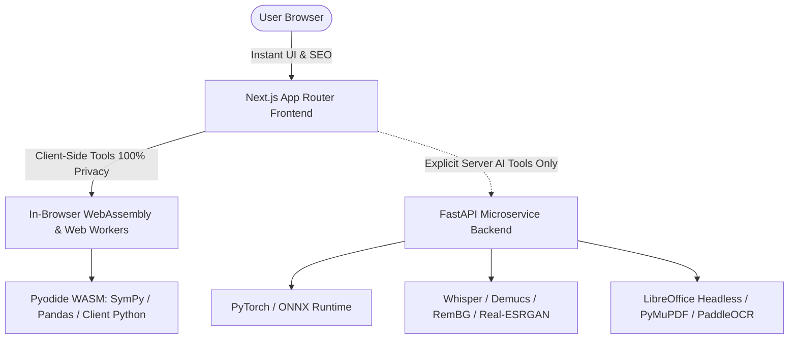
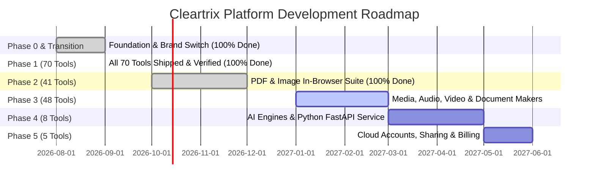

# Cleartrix: Master Project Architecture, Coding Blueprint & AI Guide

> **Product:** Cleartrix (`https://cleartrix.com`)  
> **Flagship Tool:** Cleartrix Resume Builder (formerly "Cleartrix Resume Builder")  
> **Current Platform State:** **104 Tools Live**, **113 Prerendered Static Routes**, **103 Unit Tests**, **311 Privacy-Scanned Files**, **100% Green CI (`npm run check` & `npm run build`)**.  
> **Primary Stack:** Next.js 15.5 (App Router, React 18, TypeScript 5.7, Tailwind CSS 3.4), Zustand 4.5, Zod 3.23, Radix UI primitives.  
> **AI / Heavy Processing Stack:** Python (FastAPI asynchronous microservice + in-browser Pyodide WebAssembly).  
> **Purpose of this File:** This is the single source of truth for software architecture, coding patterns, current progress, and future roadmaps. Any AI assistant or developer reading this document can immediately understand the system and build new tools with exact architectural consistency.

---

## 1. Core Mission & Non-Negotiable Invariants

Cleartrix is one unified, lightning-fast web platform hosting 175 everyday utilities across developer tools, calculators, documents, media, and design.

### The 5 Non-Negotiable Invariants:
1. **Privacy-First (Zero Server Uploads by Default):**
   - All Phase 0, 1, 2, and 3 tools must execute **100% inside the user's browser** (V8, WebAssembly, Web Workers, Canvas, Web Audio, Web Crypto).
   - Strict Content-Security-Policy: `connect-src 'self'`.
   - Zero telemetry tracking, zero third-party analytics pixels, zero external API calls carrying user data.
   - Scanned and enforced on every commit via `npm run test:privacy`.
2. **Zero Paywalls & Zero Watermarks:**
   - Every single template, export format, and tool capability is completely unlocked. No credit cards, no subscriptions, no forced registrations.
3. **Multi-Format Export Parity:**
   - Builders (like the flagship Resume Builder) maintain pixel-level layout alignment across Web DOM, Vector PDF (`@react-pdf/renderer`), and native Word (`docx`).
4. **Mandatory Statutory Disclaimers:**
   - Any tool involving financial calculations (mortgage, inflation, tax, loans) MUST include the standard financial disclaimer.
   - Any tool involving health/body metrics (BMI, BMR/TDEE, water intake, calories) MUST include the standard medical disclaimer.
5. **Strict Test & Build Verification:**
   - Code is never considered finished until `npm run check` (all 9 suites) and `npm run build` pass with zero errors and zero TypeScript warnings.

---

## 2. Codebase Directory Structure

```
cleartrix/ (cleartrix)
├── app/                                    # Next.js 15 App Router
│   ├── layout.tsx                          # Root layout with Brand metadata, ThemeProvider, Toast
│   ├── page.tsx                            # Cleartrix platform homepage
│   ├── brand/page.tsx                      # Cleartrix Brand & Design Guidelines
│   ├── dashboard/page.tsx                  # Multi-resume dashboard & management
│   ├── editor/page.tsx                     # Flagship ATS Resume Builder editor
│   ├── privacy/page.tsx                    # Privacy Policy & local-first guarantees
│   ├── terms/page.tsx                      # Terms of Service
│   └── tools/                              # Dynamic Tools Engine
│       ├── page.tsx                        # Tools Directory Hub (search + category grid)
│       ├── [category]/page.tsx             # Category Hub (all tools in category)
│       └── [category]/[slug]/page.tsx      # Dynamic SSG Tool Page
├── components/
│   ├── BrandLogo.tsx                       # Cleartrix Hex-M logo + Cleartrix legacy icons
│   ├── header.tsx                          # Universal Navbar with Tools menu & search
│   ├── footer.tsx                          # Universal Footer with legal links & category tree
│   ├── tool-shell/                         # Reusable tool container components
│   │   ├── ToolLayout.tsx                  # Standardized tool shell (H1, intro, privacy badge, FAQ, related)
│   │   ├── UploadBox.tsx                   # Drag-and-drop file upload with 5MB in-memory guard
│   │   ├── ProgressBar.tsx                 # Processing progress bar with cancel action
│   │   ├── ResultPanel.tsx                 # Output action bar (Copy, Download, Reset)
│   │   └── ErrorState.tsx                  # Friendly error and recovery container
│   └── tools/
│       ├── ToolView.tsx                    # Client-side dynamic dispatcher (RSC boundary)
│       ├── pilot/                          # Phase 0 pilot tools (5 tools)
│       └── phase1/                         # Phase 1 tools (41 tools)
│           └── <slug>/
│               ├── index.tsx               # Interactive React UI
│               ├── logic.ts                # Pure TypeScript domain logic
│               └── logic.test.ts           # Pure unit test assertions
├── lib/
│   ├── brand.ts                            # Canonical brand source of truth (BRAND config)
│   ├── empty-module.js                     # Stub file aliasing optional Node modules (canvas, encoding)
│   ├── registry/                           # Tool catalog source of truth (pure serializable data)
│   │   ├── types.ts                        # ToolDefinition, ToolMetadata, CategoryId
│   │   ├── categories.ts                   # 11 category definitions
│   │   └── tools.ts                        # Central registry of all live & planned tools
│   ├── store/                              # State management
│   │   ├── migrate-brand.ts                # Non-destructive localStorage key migration (mk_ prefix)
│   │   ├── storage-utils.ts                # Safe localStorage wrappers & quota guard
│   │   ├── use-resume-store.ts             # Active resume document state & history
│   │   └── use-resume-index-store.ts       # Multi-resume metadata index & CRUD
│   ├── pdf/                                # 20 vector PDF templates (@react-pdf/renderer)
│   ├── docx/                               # 20 Word templates (docx OOXML package generator)
│   └── import/                             # In-browser PDF & Word resume parser
├── scripts/                                # Verification & Quality Assurance Suite
│   ├── test-tools.ts                       # Unit test runner for all tool logic.ts modules
│   ├── test-registry.ts                    # Validates slug uniqueness, categories, SEO, FAQs
│   ├── test-privacy.ts                     # AST/regex scanner ensuring zero network leaks
│   ├── test-docx-templates.ts              # Validates 20 Word template packages
│   ├── test-pdf-templates.tsx              # Validates 20 PDF templates
│   ├── test-multi-resume-store.ts          # Validates multi-resume storage & brand migration
│   └── test-import-parser.ts               # Validates client-side resume import
├── prisma/schema.prisma                    # PostgreSQL database schema (Phase 5 accounts)
└── PROJECT.md                              # Master project command file
```

---

## 3. The 4-File Tool Module Pattern

Every single tool in Cleartrix follows a strict, modular 4-file pattern. Never deviate from this pattern:

### File 1: `components/tools/<phase>/<slug>/logic.ts`
- **Rule:** Contains **only pure TypeScript functions**. Zero React hooks, zero JSX, zero DOM manipulation, zero `window` or `document` calls.
- **Purpose:** All mathematical, parsing, encoding, or transformation algorithms live here.
- **Example:**
  ```ts
  export interface CalcInput { ... }
  export interface CalcResult { ... }
  export function calculateResult(input: CalcInput): CalcResult { ... }
  ```

### File 2: `components/tools/<phase>/<slug>/logic.test.ts`
- **Rule:** Exports `runTests(): boolean | Promise<boolean>`.
- **Purpose:** Executes deterministic test vectors, edge cases (empty strings, zero, negatives, boundary limits), and throws an `Error` if any assertion fails.
- **Example:**
  ```ts
  import { calculateResult } from "./logic";
  export function runTests(): boolean {
    const res = calculateResult({ ... });
    if (res.expectedField !== 42) throw new Error("Mismatch");
    return true;
  }
  ```

### File 3: `components/tools/<phase>/<slug>/index.tsx`
- **Rule:** Starts with `"use client";`. Responsive, accessible, works on mobile screens, supports Dark/Light mode (`dark:` Tailwind classes).
- **Features:**
  - One-click **Copy to Clipboard** with visual checkmark feedback.
  - File **Download** button where appropriate (e.g. minified file, SVG barcode, JSON).
  - Quick **Preset Buttons** for popular sample inputs.
  - Statutory disclaimer box if the tool calculates financial, medical, tax, or legal data.

### File 4: Registrations (3 Entry Points)
To connect the new tool to the platform, update exactly three files:
1. **`lib/registry/tools.ts`**: Add tool metadata object (slug, name, category, phase, runtime, SEO title/description/h1/intro, at least 3 FAQs, related tool slugs, and optional disclaimer).
2. **`components/tools/ToolView.tsx`**: Add dynamic import into `TOOL_COMPONENTS`:
   ```ts
   "<slug>": dynamic(() => import("@/components/tools/<phase>/<slug>"), {
     ssr: false,
     loading: () => <ToolLoadingState name="<Name>" />,
   }),
   ```
3. **`scripts/test-tools.ts`**: Import `runTests as test<Slug>`, invoke `test<Slug>()` (or `await` if async), and increment the passed counter.

---

## 4. Solved Engineering Lessons & Gotchas

Any AI or developer working on this codebase must adhere to these resolved gotchas:

1. **BigInt Literals Syntax:**
   - Never use BigInt literal notation (e.g., `0n`, `32n`, `126n`) in TypeScript files because targets lower than ES2020 will fail compilation.
   - **Always use:** `BigInt(0)`, `BigInt(32)`, `BigInt(126)`.
2. **Strict Indexed Access (`noUncheckedIndexedAccess`):**
   - In strict mode, indexing into strings or arrays like `clean[0]` or `parts[0]` returns `string | undefined`.
   - **Always use:** `clean.charAt(0)` for strings, or `parts[0] ?? 0` for arrays.
3. **Strict Block Function Declarations:**
   - In strict JavaScript/TypeScript, declaring `function helper() {}` inside `if` or `try` blocks triggers compiler errors.
   - **Always use arrow functions:** `const helper = () => {};`.
4. **Webpack 5 Server Prerender Stub (`empty-module.js`):**
   - Certain optional peer dependencies (like `canvas` or `encoding`) fail during Next.js server-side static page generation (`next build`).
   - We alias them in [`next.config.mjs`](file:///c:/Users/abc/OneDrive/Desktop/cleartrix/next.config.mjs) to a physical stub file [`lib/empty-module.js`](file:///c:/Users/abc/OneDrive/Desktop/cleartrix/lib/empty-module.js) (`module.exports = {};`).
5. **RSC Serialization Boundary:**
   - Keep [`lib/registry/tools.ts`](file:///c:/Users/abc/OneDrive/Desktop/cleartrix/lib/registry/tools.ts) strictly serializable data (no React functions or JSX). All dynamic imports live in [`components/tools/ToolView.tsx`](file:///c:/Users/abc/OneDrive/Desktop/cleartrix/components/tools/ToolView.tsx).
6. **Non-Destructive Brand Storage Migration (`ct_` prefix):**
   - Users may have had drafts stored under previous iterations.
   - [`lib/store/migrate-brand.ts`](file:///c:/Users/abc/OneDrive/Desktop/cleartrix/lib/store/migrate-brand.ts) **copies** old keys to `ct_` keys upon boot without deleting old keys.
   - `safeLocalStorageGet` transparently falls back to older keys if the new key is missing.

---

## 5. Python Hybrid Architecture & AI Boost (FastAPI + Pyodide)

Next.js (TypeScript) and Python form a high-performance **hybrid architecture** that balances privacy, UI speed, and deep computational/AI power:



### Layer A: In-Browser Client Python via WebAssembly (`Pyodide`)
- **How it works:** Runs standard CPython and scientific packages (NumPy, SymPy, Pandas) directly inside browser Web Workers via WebAssembly.
- **Privacy benefit:** 100% client-side execution; user data never leaves device RAM.
- **Use cases:** Symbolic algebra & calculus solver, in-browser data science tables, Python script runner/sandbox, mathematical graphing.

### Layer B: Server-Side AI Microservice (`FastAPI` Modern Stack)
When a user explicitly invokes a heavyweight Phase 4 AI tool that exceeds browser WASM capabilities (100MB+ models), the request routes to a dedicated Python backend:
- **Framework:** **FastAPI** (asynchronous ASGI, high throughput, automatic OpenAPI/Swagger documentation, strict Pydantic v2 schemas that match frontend Zod types).
- **Core AI & Media Libraries:**
  - **Speech-to-Text Transcription:** `faster-whisper` (CTranslate2-optimized OpenAI Whisper).
  - **Audio Stem Separation & Vocal Removal:** `demucs` (Meta AI state-of-the-art 4-stem model).
  - **AI Background Removal:** `rembg` / `birefnet` (deep learning alpha matting).
  - **Super-Resolution Image Upscaling:** `Real-ESRGAN` / `Upscayl` (4x image restoration).
  - **Computer Vision & Deskewing:** `OpenCV` + `scikit-image` (automatic edge detection & perspective flattening).
  - **High-Fidelity Office & PDF Conversion:** Headless `LibreOffice` + `PyMuPDF` (`fitz`) + `pdf2docx`.
  - **Document OCR:** `PaddleOCR` / `EasyOCR` for complex multi-column and multilingual document recognition.
- **Task Queue & Concurrency:** `Redis` + `Celery` / `Arq` for asynchronous job processing with streaming progress over Server-Sent Events (SSE).
- **Privacy Invariant for Server AI:** Ephemeral RAM processing (`/dev/shm`), zero disk retention, immediate auto-delete on stream completion.

---

## 6. Current Implementation State (111 Live Platform Tools!)
 
| Category | Shipped Tools (111 Total — Phase 1 & Phase 2 100% Complete!) |
| :--- | :--- |
| **Builders (1)** | `resume-builder` (Flagship ATS builder with 20 PDF + 20 Word templates) |
| **Developer (18)** | `json-formatter`, `base64-converter`, `csv-json-converter`, `hash-generator`, `url-encoder`, `html-beautifier`, `text-diff`, `regex-tester`, `html-entity-encoder`, `json-xml-converter`, `unicode-normalizer`, `sql-formatter`, `hmac-generator`, `json-yaml-converter`, `json-schema-validator`, `code-minifier`, `sql-dump-to-csv`, `excel-to-json-csv` |
| **Utilities (11)** | `word-counter`, `password-generator`, `case-converter`, `lorem-generator`, `duplicate-line-remover`, `unit-converter`, `epoch-converter`, `checksum-verifier`, `chmod-calculator`, `archive-extractor`, `archive-packer` |
| **Codes (4)** | `qr-generator`, `barcode-generator`, `barcode-scanner`, `qr-scanner` |
| **Security (4)** | `file-encryptor`, `file-decryptor`, `steganography-tool`, `metadata-stripper` |
| **Document & PDF (28)** | `ats-resume-checker`, `resume-import-viewer`, `pdf-merger`, `pdf-splitter`, `pdf-page-rotator`, `pdf-page-organizer`, `pdf-compressor`, `pdf-bates-stamper`, `pdf-flattener`, `pdf-form-extractor`, `pdf-form-builder`, `pdf-digital-signer`, `markdown-to-pdf`, `html-to-pdf`, `direct-txt-editor`, `direct-markdown-editor`, `direct-html-editor`, `pdf-redaction-tool`, `direct-rtf-creator`, `direct-docx-editor`, `pdf-annotator`, `markdown-note-maker`, `excel-to-pdf`, `docx-to-pdf`, `pdf-to-docx`, `pdf-encryptor`, `pdf-decryptor`, `powerpoint-to-pdf` |
| **Image (11)** | `image-converter`, `aspect-ratio-cropper`, `canvas-resizer`, `batch-image-compressor`, `exif-stripper`, `image-base64-converter`, `svg-minifier`, `favicon-generator`, `image-rotator-flipper`, `photo-filter-studio`, `image-watermarker` |
| **Calculators (34)** | `mortgage-calculator`, `compound-interest-calculator`, `percentage-calculator`, `bmi-calculator`, `date-calculator`, `age-calculator`, `discount-calculator`, `base-converter`, `sales-tax-calculator`, `freelance-rate-calculator`, `calorie-calculator`, `water-intake-calculator`, `auto-loan-calculator`, `scientific-calculator`, `aspect-ratio-calculator`, `bmr-tdee-calculator`, `inflation-calculator`, `ip-subnet-calculator`, `statistics-calculator`, `fraction-simplifier`, `geometry-calculator`, `time-card-calculator`, `world-clock-converter`, `bandwidth-calculator`, `sip-calculator`, `retirement-401k-calculator`, `debt-payoff-calculator`, `roi-calculator`, `profit-margin-calculator`, `break-even-calculator`, `payroll-paycheck-calculator`, `body-fat-calculator`, `target-heart-rate-calculator`, `pregnancy-due-date-calculator` |

---

## 7. Upcoming Phases & Implementation Roadmap



### Phase 2 Tool Roadmap (41/41 Tools — 100% Shipped & Verified):
- **PDF Manipulation & Forms (13 Tools):** PDF Merger, PDF Splitter, PDF Compressor, PDF Page Reorder, PDF Page Rotator, PDF Bates Stamper, PDF Encryptor, PDF Decryptor, PDF Flattener, PDF Annotator, Form Field Extractor, Fillable Form Builder, Digital Signer.
- **Document Converters (5 Tools):** DOCX to PDF, PDF to Word (DOCX), Excel to PDF, PowerPoint to PDF, Markdown to PDF/HTML.
- **In-Browser Document Creators (6 Tools):** Direct DOCX Editor, Direct TXT Creator, Markdown Note Maker, Direct RTF Creator, Direct HTML Creator, Markdown Live Editor.
- **Image Optimizers & Tools (11 Tools):** Image Format Converter (PNG/WebP/JPG/HEIC/SVG), Aspect Ratio Cropper, Canvas Resizer, Image Rotator & Flipper, Batch Image Compressor, Color Balancer, Photo Retouching Filter Tool, Watermarker, Multi-Size Favicon Generator, SVG Minifier, EXIF Stripper.
- **Security & Privacy (5 Tools):** Protected File Locker (AES-256), Protected File Decryptor, Steganography Tool, Metadata Stripper, PDF Redaction Tool.
- **Local Utility (1 Tool):** Image to Base64 Data URI Converter.

---

## 8. The AI Developer Workflow (Step-by-Step Playbook)

When instructed to add new tools or modify the codebase, follow these exact steps:

1. **Step 1: Inspect Registry & Plan**
   - Check `lib/registry/tools.ts` to see existing slugs and categories.
2. **Step 2: Create Tool Module**
   - Write `components/tools/phase1/<slug>/logic.ts` with pure typed functions.
   - Write `components/tools/phase1/<slug>/logic.test.ts` with assertions.
   - Write `components/tools/phase1/<slug>/index.tsx` with responsive UI, presets, and copy/download controls.
3. **Step 3: Register Tool**
   - Add definition to `TOOLS` in `lib/registry/tools.ts`.
   - Add dynamic import in `components/tools/ToolView.tsx`.
   - Add test runner import and invocation in `scripts/test-tools.ts`.
4. **Step 4: Execute Verification Suite**
   - Run `npx tsx scripts/test-tools.ts` (all unit tests must pass).
   - Run `npx tsx scripts/test-registry.ts` (schema integrity must pass).
   - Run `npm run check` (TypeScript, ESLint, privacy scanner, all template tests).
   - Run `npm run build` (Next.js must generate all SSG routes cleanly).
5. **Step 5: Document & Report**
   - Update project walkthrough documentation and `PROJECT_BLUEPRINT.md`.
